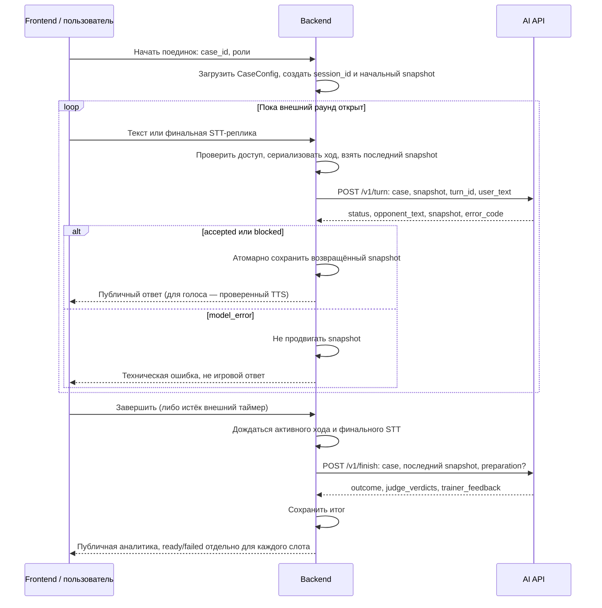

# Сценарий вызовов AI: от кейса до результата

Этот гайд описывает действующий v1. Для универсальных кейсов есть отдельный
[проект v2](../integration/contract-v2-handoff.md), пока не реализованный в API.

Это межсервисный flow **Backend → AI**, не браузерный API. AI не создаёт сессии
в БД и не загружает кейс по ID: каждый запрос содержит полный `case` и `snapshot`.
Backend хранит их канонические версии. Схемы:
[CaseConfig и SessionSnapshot в OpenAPI](openapi.json), раздел `components.schemas`.

Base URL текущего сервера: `http://172.16.34.7:8000`.
Для turn/finish нужен `Authorization: Bearer <AI service token>`.
Пользовательский JWT проверяет Backend; он не заменяет service token.

## 1. Общая последовательность



Пути начала сессии, отправки текста и чтения результата на Backend согласовывают
его владельцы с Frontend. Это не новые реализованные маршруты AI.
Согласие сторон (`state.stage=agreed`) не завершает внешний раунд автоматически.

## 2. Создать исходные данные на Backend

Пример **вымышленного учебного кейса**, не утверждённые вводные реального поединка:

```json
{
  "id": "example-next-day",
  "title": "Учебный разговор о повышении",
  "shared_context": "Менеджер и директор обсуждают повышение после пропущенного рабочего дня.",
  "player_role": "Менеджер",
  "opponent_role": "Генеральный директор",
  "player_private_context": "Менеджер хочет согласовать измеримые условия повышения.",
  "opponent_private_context": "Директор хочет восстановить предсказуемость работы до повышения."
}
```

Это минимальный `CaseConfig`; необязательные поля получают defaults.
Для реального кейса Backend передаёт утверждённые `agreement_rules`,
`opponent_private_phrases` и `opponent_strategy`, если они предусмотрены.
Не подставлять учебные defaults вместо согласованных правил.
[Расширенный пример позиции](examples/backend-position-turn.json).

Backend генерирует `session_id` и сохраняет начальный `SessionSnapshot`:

```json
{
  "session_id": "example-session-001",
  "state": {"turn_count": 0},
  "transcript": []
}
```

Начальные `stage=negotiating`, `agreement=null`, `decision=null` и
`opponent_progress=null` выставляются defaults. Не отправляйте неизвестные поля:
контракты запрещают extra fields. Закрытые вводные не берутся из доверенного на слово JSON браузера.

## 3. Первый ход

```http
POST /v1/turn HTTP/1.1
Host: 172.16.34.7:8000
Authorization: Bearer <AI service token>
Content-Type: application/json

{
  "case": {
    "id": "example-next-day",
    "title": "Учебный разговор о повышении",
    "shared_context": "Менеджер и директор обсуждают повышение после пропущенного рабочего дня.",
    "player_role": "Менеджер",
    "opponent_role": "Генеральный директор",
    "player_private_context": "Менеджер хочет согласовать измеримые условия повышения.",
    "opponent_private_context": "Директор хочет восстановить предсказуемость работы до повышения."
  },
  "snapshot": {
    "session_id": "example-session-001",
    "state": {"turn_count": 0},
    "transcript": []
  },
  "turn_id": "example-turn-001",
  "user_text": "Предлагаю обсудить измеримые условия повышения."
}
```

Ответ содержит `session_id`, `turn_id`, `status`, `opponent_text`, `snapshot`,
`error_code`. Точная структура ответов для всех трёх статусов:
[managed-turn.json](examples/managed-turn.json). Текст ответа модели не фиксирован.

| `status` в HTTP 200 | Действие Backend |
| --- | --- |
| `accepted` | Сохранить весь новый snapshot, показать/озвучить opponent_text |
| `blocked` | Сохранить весь новый snapshot, показать/озвучить безопасную реакцию |
| `model_error` | Не продвигать snapshot; показать техническую ошибку, сохранить error_code |

## 4. Следующие ходы

Тело следующего запроса: **тот же канонический `case` + весь `snapshot` из предыдущего
успешно сохранённого ответа + новый `turn_id` + новая реплика**.
Не увеличивать `turn_count` вручную и не собирать snapshot заново из сообщений чата.
В том числе сохранять и передавать `state.opponent_progress`, если он появился.

Псевдокод Backend (не готовая реализация его API):

```text
под блокировкой/сериализацией конкретной сессии:
    проверить пользователя и открытость раунда
    case, snapshot = прочитать канонические данные
    command_id = зафиксировать новую попытку
    response = AI.turn(case, snapshot, command_id, user_text)
    проверить HTTP, контракт и session_id/turn_id ответа
    если response.status в [accepted, blocked]:
        атомарно сохранить response.snapshot и подтверждённый ответ
        вернуть публичную проекцию
    иначе если response.status == model_error:
        сохранить диагностический код без продвижения снимка
        вернуть техническую ошибку
```

Не допускать два активных turn или гонку turn/finish одной сессии.
AI stateless и не дедуплицирует `turn_id`. После неоднозначного timeout не повторять
вызов автоматически: результат мог быть вычислен, повтор запустит новую генерацию.
Восстановление статуса и command records — ответственность Backend.

## 5. Завершение

После фиксации последней реплики отправить:

```text
POST /v1/finish
Authorization: Bearer <AI service token>
Content-Type: application/json

{
  "case": <полный канонический CaseConfig>,
  "snapshot": <последний сохранённый SessionSnapshot>,
  "preparation": null
}
```

Это шаблон сборки тела, не буквальный JSON для отправки. `preparation` можно опустить
или заменить карточкой; [полный JSON запроса и ответа](examples/preparation-finish.json).
Карточка нужна Trainer, не судьям. AI сам обращается к методическому retrieval;
Backend не передаёт методички в запрос.

Результат: `session_id`, `outcome`, три `judge_verdicts` и `trainer_feedback`.
Backend сохраняет его для повторного открытия страницы, не вызывает finish на каждый reload.
Готовые слоты показываются даже при failed других слотов. Нет общего числового score;
методики, названия источников и ссылки в пользовательской аналитике не выводятся.
Finish без принятого хода возвращает HTTP 409, а не пустой demo-результат.

## 6. Вызов через curl из серверной среды

Для ручного вызова оператор готовит в защищённом каталоге:

- `turn-request.json` — полное тело из раздела 3 (с реальными серверными вводными).
- `finish-request.json` — полный case и актуальный сохранённый snapshot.
- `/run/secrets/arena-ai.headers` — файл с `Authorization: Bearer <реальный токен>`
  и `Content-Type: application/json`, каждый заголовок на отдельной строке, доступ только оператору.

Путь к secret-файлу — пример, не файл, автоматически создаваемый нашим Compose.
Не вводите сам токен в командную строку и не включайте shell tracing / curl verbose.
Запросы/ответы содержат закрытые данные: права каталога `0700`, файлов `0600`,
не отправлять их в Git или чат. Команды выполняются из этого каталога:

```bash
umask 077
curl --silent --show-error --fail-with-body --connect-timeout 3 --max-time 900 \
  --header @/run/secrets/arena-ai.headers \
  --data-binary @turn-request.json \
  --output turn-response.json http://172.16.34.7:8000/v1/turn
```

Проверить HTTP и `status`, сохранить снимок по таблице, собрать finish с **новым**
снимком. Только после этого:

```bash
curl --silent --show-error --fail-with-body --connect-timeout 3 --max-time 900 \
  --header @/run/secrets/arena-ai.headers \
  --data-binary @finish-request.json \
  --output finish-response.json http://172.16.34.7:8000/v1/finish
```

900 секунд — предел ожидания ручной диагностики, не длительность раунда и не гарантия
скорости. HTTP 200 ещё не означает accepted или готовность всех аналитических слотов.
Не добавляйте `--retry` к этим командам.

Полные обязанности компонентов и таблица ошибок:
[гайд интеграции](../integration/team-integration.md).
